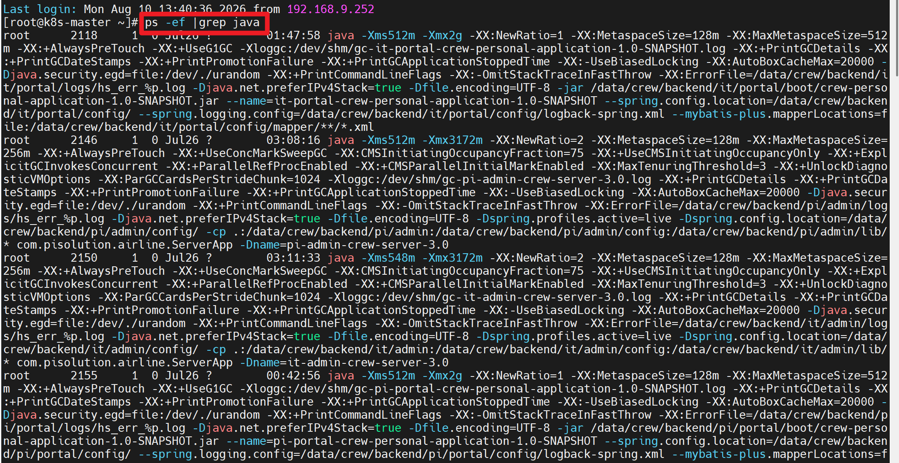
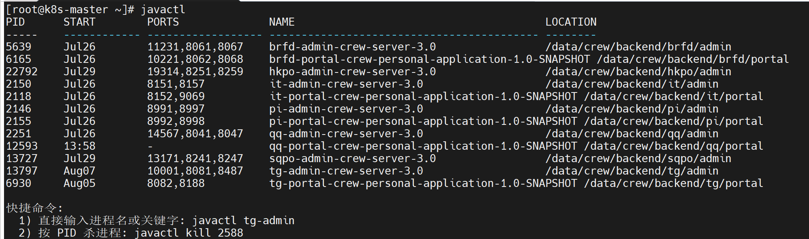

## javactl命令(在linux中查看/kill java进程)，抓取信息（PID，启动时间，端口，jar包启动类，jar包位置）
### 只在特定情况下代替[ps -ef|grep java]
当linux的java进程很多，且端口映射不止一个，启动命令繁杂时，直接使用ps -ef|grep java 会出现下面这种情况

很明显，肉眼第一时间抓取不到有效信息，但是如果使用javactl,就可以直接看到有效信息

### 0.创建一个临时目录：/data/javatemp
把三个脚本全部放到这个临时文件夹下面，如果之前没有安装过直接执行第二步；

### 1.先卸载
sh uninstal_javactl.sh

执行hash -r

### 2.安装到/usr/local/bin
sh install_javactl.sh /data/javatemp/javactl.sh /usr/local/bin/javactl

执行hash -r