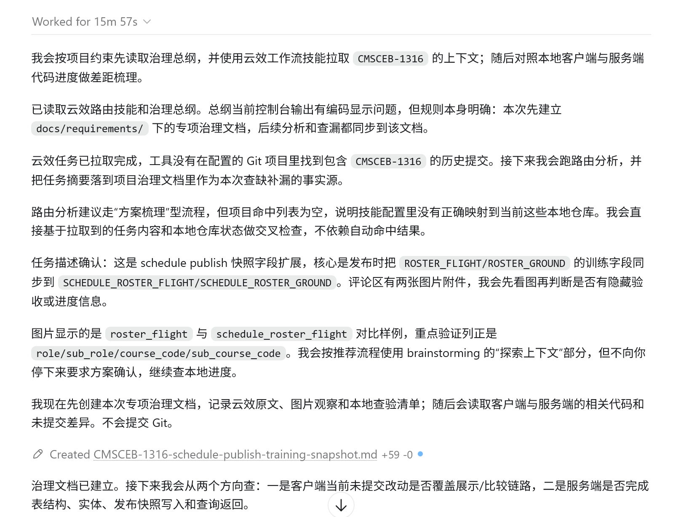

## 使用步骤

1.复制整个文件夹到本地.codex/.claude/.agents（可以都复制，看你本地装了几个agent）的skills目录下

2.配置好config.json中云效的相关配置：token，组织id，项目空间映射，本地项目位置映射，文档输出目录

### 下面是一段vibecoding的prompt：

CMSCEB-1316 拉取云效任务，梳理功能改造点，再看一下本地客户端和服务端当前的开发进度，查缺补漏

