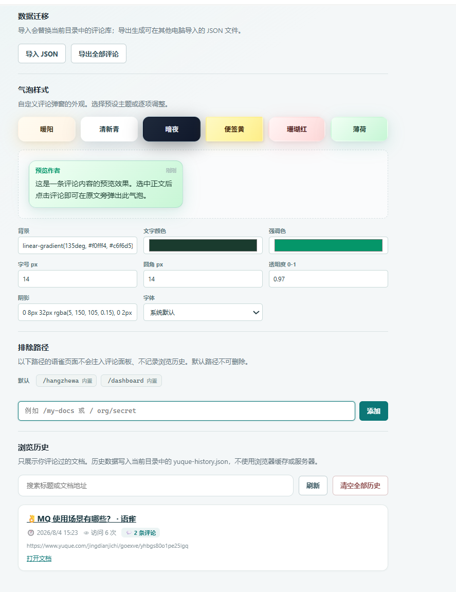
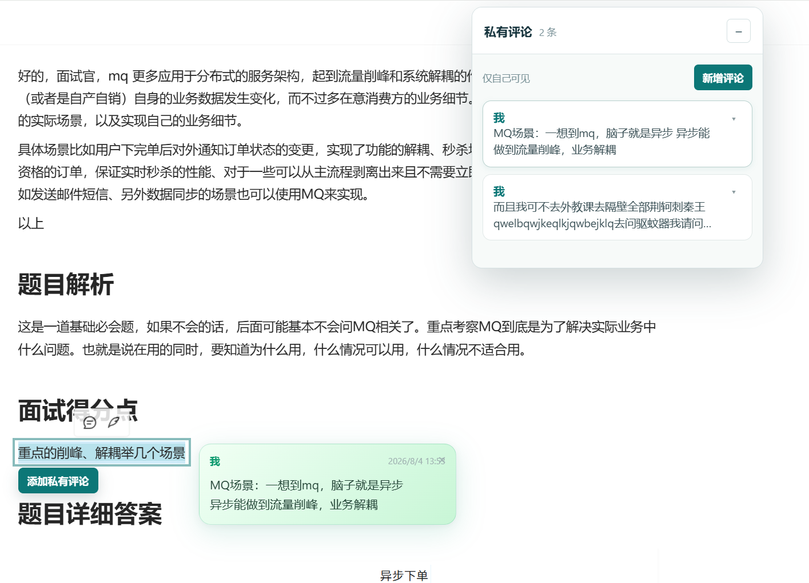

# 语雀私有评论

这是一个 Chrome MV3 浏览器扩展 MVP，用于在 `yuque.com` 文档右侧维护只属于自己的评论，并在同一个本地目录记录语雀浏览历史。评论和历史都不调用语雀私有 API，也不会上传到后端；数据通过 File System Access API 写入用户选择目录中的固定文件：

```text
private-comments.json
yuque-history.json
```

## 开发与构建

环境要求：

- Node.js 18+
- npm
- 支持 File System Access API 的新版 Chrome

执行：

```bash
npm install
npm test
npm run build
```

构建结果在 `dist/`。Vitest 覆盖文档 key、URL 排除规则、评论和历史 schema、评论/历史 CRUD、内存存储、文件存储和坏 JSON 保护。

## 加载扩展

1. 执行 `npm run build`。
2. 打开 Chrome 的 `chrome://extensions`。
3. 开启右上角“开发者模式”。
4. 点击“加载已解压的扩展程序”，选择仓库下的 `dist` 目录。
5. 打开语雀文档，页面右侧会出现“私有评论”面板。
6. 从扩展 popup 或“扩展详情 > 扩展程序选项”中选择或创建一个本地目录。

选择成功后，“本地目录”区域会显示“设置成功”，后台会从扩展 IndexedDB
恢复目录句柄，并同时创建或校验以下两个文件：

```text
private-comments.json
yuque-history.json
```

正常选择目录后不需要重新加载扩展。如果刚执行了新的 `npm run build`，需要在
`chrome://extensions` 中点击扩展的“重新加载”，并关闭旧 popup/options 后重新
打开设置页；旧设置页不会自动使用新构建脚本。若 Chrome 已撤销目录授权，重新
选择一次目录即可。

扩展只匹配：

- `https://yuque.com/*`
- `https://*.yuque.com/*`

content script 还会在运行时执行纯函数 URL 排除判断，因此仅依赖 manifest 匹配不能绕过以下规则：

- `https://www.yuque.com/hangzhewa` 及其所有子路径
- `https://www.yuque.com/dashboard` 及其所有子路径

上述排除页不注入私有评论面板，也不会写入 `yuque-history.json`。相似路径（例如 `/dashboarding`）和其他语雀子域名不在排除范围内。

## 使用说明

- 在语雀文档中选中文本后点击“新增评论”，选中文本和锚点会自动带入，也可以手工修改。
- 新评论会同时保存 TextQuote（exact/prefix/suffix）、正文块结构指纹、块内 TextPosition 和旧版 `rangeAnchor`；跨行内节点的选区会映射回真实 Text 节点后再恢复 Range。
- 评论卡片的“定位原文”按 TextQuote、TextPosition、旧版 `rangeAnchor`、`selectedText` 全局搜索、锚点/块级兜底的顺序定位，成功状态会明确显示使用的层级。
- 旧评论即使没有新 selector 也会继续使用旧路径、选中文本和锚点回退；所有定位失败都会显示已尝试的层级和失败提示。
- 评论面板右上角按钮会把面板收缩成窄标题胶囊，再次点击恢复完整面板；收起后仍可拖动。
- 评论字段包括选中文本、锚点、正文、作者“我”、创建时间和更新时间。
- 编辑和删除操作会直接写回本地 `private-comments.json`。
- 每条评论支持“定位原文”，会按选中文本或锚点滚动到当前文档中的对应内容并短暂高亮。
- 评论面板右上角按钮可最小化为窄标题条，再次点击恢复；标题栏仍可拖动。
- 正常语雀文档页加载时，后台会按 `documentKey` 更新 `yuque-history.json` 中的最近访问时间和访问次数。
- 扩展设置页的“浏览历史”面板支持按标题或文档地址搜索、刷新、打开文档和确认后清空全部历史。
- popup/options 支持导入 JSON 和导出当前目录中的全部评论。
- 导入会替换当前目录中的评论库，导入内容必须符合版本为 `1` 的 schema。
- 页面无法找到已授权目录时会显示“未连接本地目录”，不会把评论写入浏览器缓存或语雀。

## 权限与浏览器限制

扩展声明的权限只有：

- `storage`：保存目录名、文件名和连接状态等设置提示。
- 语雀匹配范围：让 content script 只在语雀页面运行。

目录句柄不能直接写入 `chrome.storage.local`，也不会通过
`chrome.runtime.sendMessage` 传给 service worker。设置页会把
`FileSystemDirectoryHandle` 直接保存到扩展 IndexedDB，后台只接收目录名并从
IndexedDB 恢复句柄，以便 service worker 重启后继续访问；如果浏览器策略不允许
持久化句柄，页面会显示具体失败原因并要求重新选择目录。

File System Access API 受安全上下文和浏览器权限控制。目录授权必须由扩展
popup/options 中用户点击选择目录完成，不能由语雀 content script 或 service
worker 静默弹出系统目录选择器。后台连接时会实际访问并校验
`private-comments.json` 和 `yuque-history.json`，不依赖 service worker 中可能
不存在的 `requestPermission` 方法。用户撤销权限、浏览器不支持 API、目录不可
读写或任一 JSON 损坏时，扩展会显示错误，不会静默覆盖坏数据。

## 多台电脑与隐私边界

在电脑 A 的扩展设置中点击“导出全部评论”，将导出的 `private-comments.json` 通过用户自己的安全方式复制到电脑 B。电脑 B 安装扩展后选择目标本地目录，再点击“导入 JSON”。扩展不会自动同步目录，也不提供云端备份。

隐私边界如下：

- 评论正文、选中文本和锚点只写入用户选择的本地文件。
- 浏览历史标题、URL、documentKey、最近访问时间和访问次数只写入同一目录下的 `yuque-history.json`，不写入 `chrome.storage` 或服务器。
- 扩展不依赖后端，不读取语雀私有 API，不把评论发送给语雀。
- 拥有本机目录访问权限的程序或用户可以读取该 JSON；请不要把导出文件放到共享或不可信目录。
- 清理目录中的 `private-comments.json` 会删除该目录下保存的评论数据。
- 清理目录中的 `yuque-history.json` 会删除该目录下保存的浏览历史数据。


## 配置界面


## 文档界面
